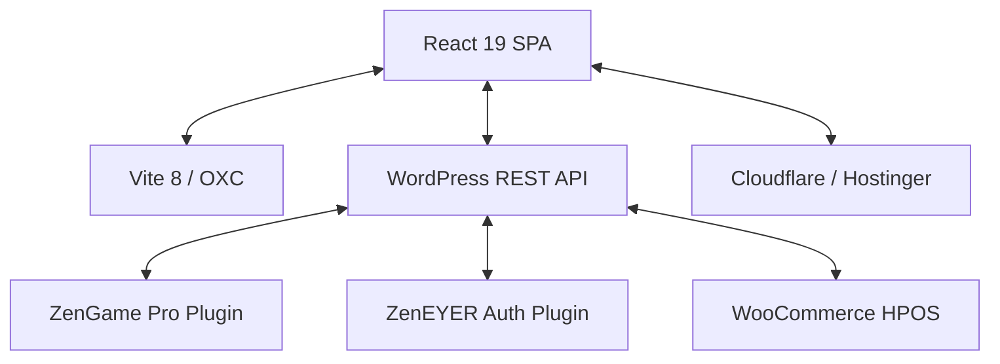

# DJ Zen Eyer — Central Context

> Resumo operacional. Documento canônico completo: `AI_CONTEXT_INDEX.md`.
> Idioma padrão: Português Brasileiro.

## 🏗️ Arquitetura Completa

## 🛠️ Stack Baseline (2026-03-26)
- **Frontend:** React 19, Vite 8 (OXC), Tailwind 4, React Query v5, i18next.
- **Backend:** WordPress 6.9+, PHP 8.3, WooCommerce (HPOS), GamiPress.
- **CI/CD:** GitHub Actions (fetch-depth: 2, plugin detection) → SSH rsync.

## 🗺️ Mapa de Arquivos Chave

| Arquivo/Pasta | Responsabilidade |
|---|---|
| `src/hooks/useQueries.ts` | **SSOT Data Fetching**. Centralizador de todas as queries. |
| `src/contexts/UserContext.tsx` | Gerenciamento de Sessão e Auth (JWT/Google). |
| `plugins/zengame/` | Engine de gamificação (Stats, Ranks, Leaderboard). |
| `plugins/zeneyer-auth/` | Autenticação master e validação de tokens Bearer. |
| `src/locales/` | Traduções PT/EN em arquivos JSON UTF-8. |
| `.github/workflows/deploy.yml` | Pipeline de deploy automatizado. |
| `scripts/prerender.js` | Geração de HTML estático por rota para SEO. |

## 🕹️ ZenGame Contracts
- **Leaderboard:** Cache 1h. Invalidado em toda premiação.
- **Dashboard:** Cache 24h. Invalidado via `clear_user_cache()`.
- **Ranks:** Usar `array_values(gamipress_get_rank_types())` para evitar bug de array associativo no GamiPress.
- **WP-CLI Deploy:** Cache clearing via `wp transient delete --search="..."`.

---
*Para execução técnica detalhada, consulte `AI_CONTEXT_INDEX.md`.*
